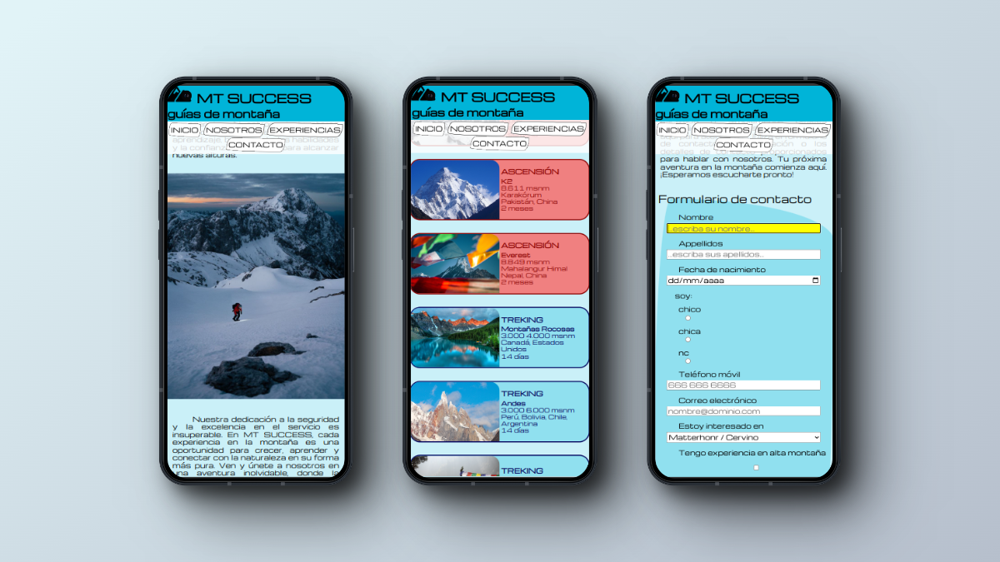

# MT Success
Landing page para empresa de servicios de guías de alta montaña: ascensiones, trekkings y cursos de escalada.

Página desplegada: [MT Success](https://alexbasurto.github.io/proyecto_rampup/)

### Proyecto Final Ramp Up 🚀
Esta es una de las 3 pruebas finales del ramp up del bootcamp en desarrollo web full stack:
- proyecto HTML y CSS plano (este)
- proyecto JS Vanilla
- examen test JS

### Mobile First, queries
- mobile M 375px
- tablet, 768px
- desktop, 1280px

### Acerca de las imágenes
Fotos y video de la página NOSOTROS son propios. El resto, son de Pexels.
Favicon de Pexels.

### Acerca de los textos

Los textos de cada página han sido generados por CHAT GPT 3.5 a partir de los siguientes prompts:

**Q:** quiero un texto para la pagina principal de una web de una empresa de guias de montaña. Son la élite de los guias de montaña y dan servicio en todo el mundo, incluido los Himalayas. La empresa, aparte de dar servicio como guias de montaña tanto para ascensiones como para rutas, también ofrece cursos de senderismo, alpinismo y escalada. La empresa se llama MT SUCCESS

**Q:** Bien, la página va a tener otra página llamada 'nosotros', donde explicamos el origen de la empresa y la motivación de la misma. Contará como su fundador, Alex, recibió la afición a la montaña de su padre desde pequeño, y como eso le llevo, junto a sus amigos Iñigo y Asier a fundar la compañía.

**Q:** Otra de las páginas con la que va a contar la página es una llamada 'EXPERIENCIAS', donde vamos a ofrecer 4 experiencias de Trekking (Treking Alpes, Treking Himalayas, Treking Montañas Rocosas y Treking Andes), 4 expereincias de ascensión (Pico Mont Blanc, Pico Matterhorn, Pico K2 y Pico Everest) y 2 cursos de escalada (uno para adultos y otro para niños). 10 experiencias en total.
Necesito un texto introductorio y un título para esa página, después yo añadiré una cajita a modo tarjeta para cada una de las experiencias.

**Q:** me puedes crear una versión más corta?

**Q:** Gracias, ya solo me queda el texto para la página contacto, que irá antes del formulario de contacto.

**Q:** contactar y conectar no son sinonimos

